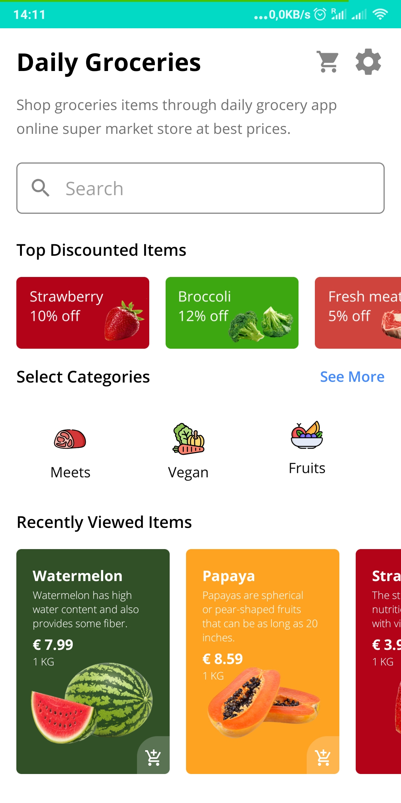
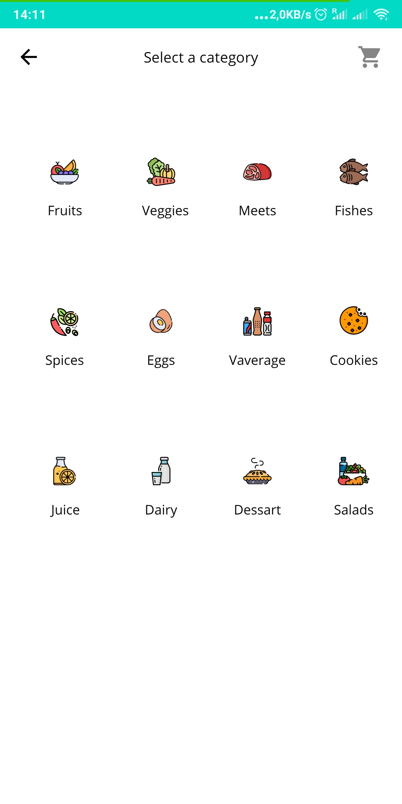
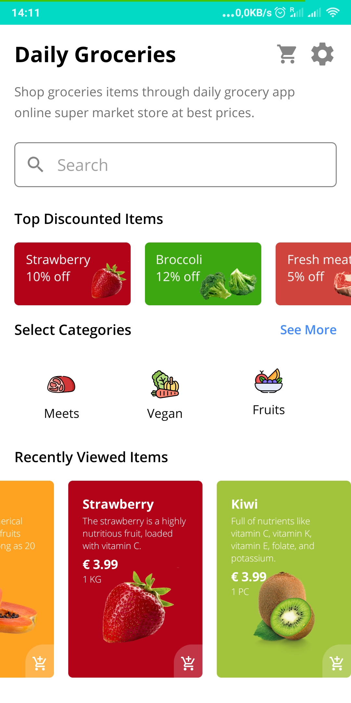
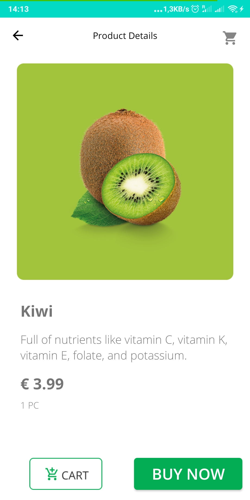

# Groceries Store Android APP 🥦🥕🍅🥬🍓 🛍

    

The online daily groceries store is a simple **Android** Application with a modern, appealing UI design meant to ease your daily grocery shopping process. The project is written in **Java** using **Android Studio** and it uses basic elements of the Android framework like: Views, Layouts, Resources, Activities, Intents and many others.

 

# Demo 

To run the applicaiton download the build apk from the link below, uplaod the apk into your android device and install the aplication from the build apk.

### [APK](./groceriesStore.apk)

 
 

# Features

* Recycler view for viewing the products on discount 🏷 🤑
* Recycler view for viewing the categories
* Recycler view for the Recently Viewed Items
* Details displayed on each card of the recently views items for the name of the product, description, price, measuring unit, product image display and an add to cart icon in bottom right.
* See more link to show all the categories in a new page.
* A product details page accessible by clicking on one of the recently view items. Opens a new page displaying the details about the product and two buttons for adding the product to the cart and buying the product.
 
 
 

<li>
 The application does not have implemented the functionality for adding the item to the cart or the functionality for buying the product. These features will be released in a future version.

 
 
 

# Technologies used :
 
<h2> 

&nbsp;&nbsp;&nbsp;&nbsp;&nbsp;
* Android Studio  
 

# Gallery

 
 
 

# To run the project locally

## Pre-requisites:
- Android Studio
- Android SDK

## Steps:

1. Clone the repository or download the source code in a zip
2. Open Android Studio with the project.
3. Run the app on the emulator or on the USB connected phone.

### Have fun with project and thank you for your attention. 😊 😉
